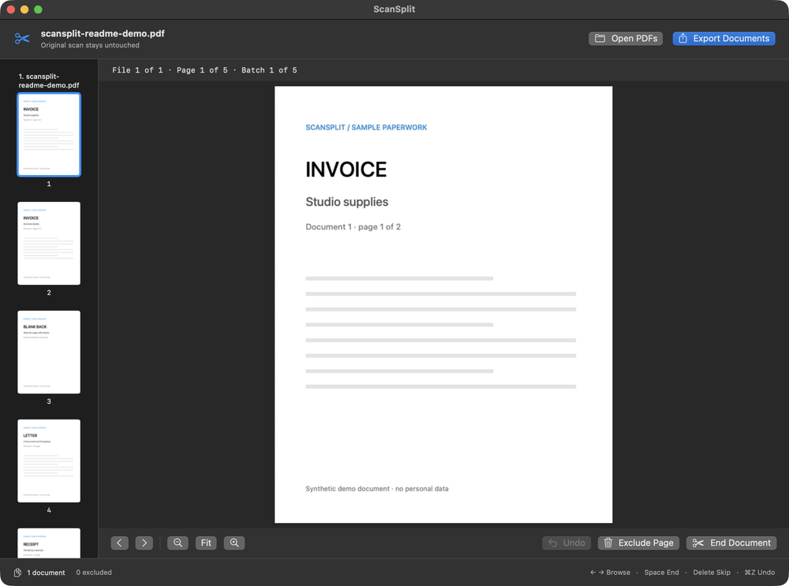
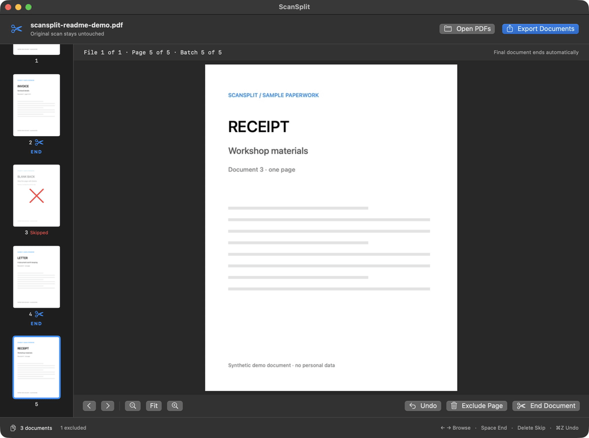

# ScanSplit

**Scan the whole pile. Keep each document separate.**

Your scanner gives you one long PDF. You need an invoice, a letter, and a receipt you can actually file, find, or send separately. ScanSplit turns that bulk scan into individual PDFs in one keyboard-driven review pass.

Open your scans, press **Space** where a document ends, press **Delete** on blank backs, and export everything together. Your original files stay untouched, and processing happens locally on your Mac.

[**Download ScanSplit for macOS**](https://github.com/tmault/scansplit/releases/latest) · [Release notes](CHANGELOG.md)

## From a scan to documents you can use



*Real ScanSplit 0.2.0 footage with synthetic paperwork. Five scanned pages → three documents, with one blank back skipped. Frames are paced for readability.*

## Why it earns a place after your scanner

Scanning the pile is only half the job. A PDF containing every bill, receipt, and letter still leaves you extracting page ranges and saving files one at a time.

ScanSplit gives that pile a useful next step:

- **File one document at a time.** Keep an invoice together, separate the next letter, and produce PDFs ready for your folders or document archive.
- **Send only the relevant pages.** Export the document someone needs instead of handing over the whole scanning session.
- **Clear out blank backs as you go.** Delete marks a page to skip and advances to the next. You can still see it, revisit it, or restore it.
- **Keep your hands on the keyboard.** Browse with the arrows, mark with Space, skip with Delete. Each marking advances, so reviewing stays a continuous pass.
- **Handle several scans together.** Open multiple PDFs in one session without merging them first. Each source file ends automatically, so unrelated scans stay separate.
- **Keep paperwork on your Mac.** No account, upload, or remote processing. Retained original PDF pages are copied into the outputs, preserving scan resolution and page geometry.

It's useful for the monthly admin pile, receipts after a trip, or a stack of old paperwork heading into a digital archive.

## Get started

Requires **macOS 14 or later**. The packaged app runs without developer tools.

1. Download the app ZIP from [the latest release](https://github.com/tmault/scansplit/releases/latest), unzip it, and move **ScanSplit.app** to Applications.
2. Open ScanSplit and choose **Open PDFs**, or drop PDFs into the window.
3. Review the pages. Press **Space** on the last page of each document and **Delete** on pages you want to leave out.
4. Choose **Export Documents**, select a destination, then use **Show in Finder** to see your PDFs.

The current release is locally signed and **not notarized**; macOS may require approval to open it.

## Change your mind. Then export the batch.



*Command-Z returns to the page you changed. This demo then reapplies the boundary and exports three PDFs containing four retained pages. The destination chooser is omitted.*

| Key | What it does |
| --- | --- |
| ← / → | Previous / next original page |
| Space | Toggle document end, then advance |
| Delete / Forward Delete | Exclude or restore a page, then advance |
| ⌘Z | Undo the last marking and return to its page |
| ⌘O | Open one or more PDFs |
| ⌘E | Export documents |

Click any thumbnail to revisit a page. Press Delete again to restore a skipped page, or Space to remove a boundary you added. Fit and the zoom buttons help you inspect small print. Held Space/Delete keys won't accidentally mark a run of pages.

The last document ends automatically. With multiple PDFs, every source file has a fixed ending that cannot be removed. File order follows the supplied or chooser-returned order; there is no reorder list. The header shows your position within the file and across the batch.

## What you get on disk

For a source named `scan.pdf`, ScanSplit creates a new folder inside your chosen destination:

```text
scan-split/
├── scan-001.pdf
├── scan-002.pdf
└── scan-003.pdf
```

For several sources, a `scansplit-batch` folder contains names such as `001-first-scan.pdf`, `002-first-scan.pdf`, and `003-second-scan.pdf`. Numbering follows review order, including when a file is completely skipped. Empty document groups are omitted.

Export again and you get a new numbered folder, without overwriting earlier exports. Mounted network shares are supported; shares requiring the compatible export method place the PDFs in a `Documents` subfolder.

ScanSplit checks that the source files haven't changed and reopens every output before publishing the completed batch. You can cancel an export and retry with your review decisions intact.

## Know before you start

- **Export before quitting.** Review decisions live in memory; there are no saved, resumable sessions. The app warns before discarding unexported decisions.
- **You decide the boundaries and blank pages.** There is no automatic blank detection, OCR, or AI classification.
- **Encrypted PDFs aren't supported.** If any file in a new import is invalid or encrypted, your existing review stays intact.
- **Splitting comes before filing.** Exported names are numbered; you can rename or import them into your preferred archive afterward. There is no built-in Paperless integration.

## Build from source

Requires Apple command-line developer tools with **Swift 6**, on macOS 14 or later. ScanSplit uses SwiftUI, AppKit, PDFKit, CoreGraphics, and CryptoKit, with no external package dependencies.

```sh
git clone https://github.com/tmault/scansplit.git
cd scansplit
./script/build_and_run.sh
```

To run the tests or package a release build:

```sh
./script/test.sh
SCANSPLIT_CONFIGURATION=release ./script/build_and_run.sh --build-only
```

The build script packages and locally signs `dist/ScanSplit.app`. Its default Run action stops the existing development instance before rebuilding, so export your decisions first. `--build-only` packages without stopping it.

Optional development modes: `--verify`, `--debug`, `--logs`, and `--telemetry`. The test script explicitly loads the bundled Swift Testing macro plugin when needed by the command-line toolchain.

See the [changelog](CHANGELOG.md) for release history.
